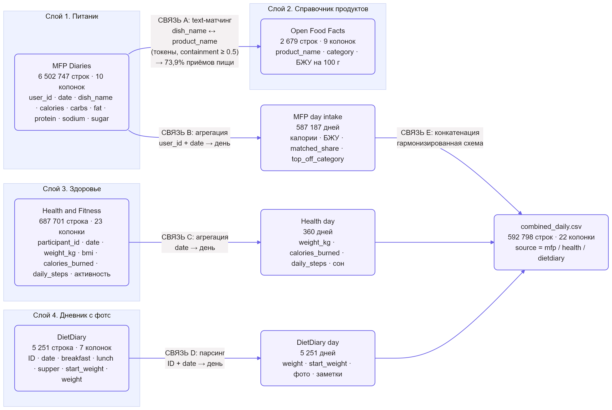

# Описание данных проекта

Данные дипломного проекта состоят из четырёх независимых слоёв.
Общих ключей между слоями нет (разные пользователи и периоды), поэтому
они связаны на уровне **гармонизированной ежедневной схемы** с колонкой
`source` (mfp / health / dietdiary) и текстового сопоставления блюд.

## 1. Health and fitness — активность и вес (основной слой)

- Источник: Kaggle (evan65549, лицензия CC0), **Health and fitness dataset**.
- Объём: 687 701 запись × 23 колонки, 3 000 участников, период 2024 год.
- Роль: EDA, корреляции, целевая переменная `weight_kg`, подготовка к ML.

| Колонка | Тип | Смысл |
|---|---|---|
| `participant_id` | int | участник |
| `date` | datetime | дата и время тренировки |
| `age`, `gender` | int / str | демография |
| `height_cm`, `weight_kg`, `bmi` | float | антропометрия |
| `activity_type` | str | тип тренировки (Walking, Running, HIIT и др.) |
| `duration_minutes` | float | длительность тренировки |
| `intensity` | str | Low / Medium / High |
| `calories_burned` | float | потраченные калории |
| `daily_steps` | int | шаги за день |
| `avg_heart_rate`, `resting_heart_rate` | float | пульс |
| `blood_pressure_systolic / diastolic` | float | давление |
| `endurance_level` | float | выносливость |
| `sleep_hours` | float | сон |
| `stress_level`, `hydration_level` | int / float | стресс и гидратация |
| `smoking_status` | str | курение |
| `health_condition` | str | хронические заболевания (часто пусто → `Unknown`) |
| `fitness_level` | float | уровень подготовки |

## 2. MyFitnessPal Diaries (MFP) — питание

- Источник: `mfp-diaries.parquet`, 6 502 747 записей × 10 колонок, период 2014–2015.
- Роль: записи приёмов пищи с калориями и БЖУ, сопоставляются со справочником OFF.

| Колонка | Тип | Смысл |
|---|---|---|
| `user_id` | str | пользователь |
| `date` | datetime | дата приёма пищи |
| `meal_sequence` | int | номер приёма пищи в дне |
| `dish_name` | str | название блюда (для сопоставления с OFF) |
| `calories`, `carbs`, `fat`, `protein`, `sodium`, `sugar` | float | калории и БЖУ |

## 3. Open Food Facts (OFF) — справочник продуктов

- Источник: `food_data.csv`, 2 679 записей × 9 колонок.
- Роль: нормализованный справочник для текстового сопоставления блюд MFP.

| Колонка | Тип | Смысл |
|---|---|---|
| `product_name` | str | название товара (токены для сопоставления) |
| `category` | str | иерархия категорий через запятую (берётся первая) |
| `energy_kcal_100g` | float | калории на 100 г |
| `fat_100g`, `sugars_100g`, `carbohydrates_100g` | float | БЖУ на 100 г |
| `serving_size_g`, `packaging_quantity` | float / str | порция и упаковка |
| `source_url` | str | ссылка на карточку продукта |

## 4. DietDiary — дневник питания с фото

- Источник: официальный датасет репозитория
  [yxG1005/Weight_Prediction](https://github.com/yxG1005/Weight_Prediction)
  («Navigating Weight Prediction with Diet Diary», ACM Multimedia 2024 Oral,
  arXiv 2408.05445): `data.csv` + `predict_ingr.json` + `DietDiary.zip` (фото).
- Объём: 5 251 запись × 7 колонок, 611 пользователей, период 2017–2021.
- Роль: ежедневный вес и фото приёмов пищи (перспективная ветвь диплома).

| Колонка | Тип | Смысл |
|---|---|---|
| `ID` | str | пользователь |
| `date` | datetime | дата дня |
| `breakfast`, `lunch`, `supper` | str | приёмы пищи в формате `фото1;фото2\|\|\|ингредиенты через пробел` |
| `start_weight` | float | вес в начале дневника |
| `weight` | float | вес за день (целевая) |

## 5. Как слои связаны

1. **MFP ↔ OFF**: инвертированный индекс по токенам названий, скор
   containment = |блюдо ∩ товар| / min(|блюдо|, |товар|), порог ≥ 0.50.
   Результат: 4 804 877 из 6 502 747 приёмов пищи (73.9%), средний скор 0.677.
2. **MFP + Health + DietDiary**: дневная агрегация каждого слоя и объединение
   в единую таблицу `combined_daily.csv` (592 798 строк × 22 колонки)
   с колонкой `source` и гармонизированными полями: калории/БЖУ (intake),
   расход энергии и вес (Health), вес и заметки (DietDiary).
3. **Ограничения**: пользователи и годы в слоях не пересекаются, поэтому
   прямая склейка по пользователю невозможна; объединение дневное и семантическое.

## 6. Схемы выходных файлов

| Файл | Смысл |
|---|---|
| `data/processed/health_clean.csv` | очищенный слой Health |
| `data/processed/mfp_day_intake.csv` | дневной intake MFP, обогащённый OFF |
| `data/processed/dietdiary_day.csv` | вес и фото по дням |
| `data/processed/combined_daily.csv` | единая ежедневная таблица 4 слоёв |
| `data/ml/X_train.csv`, `X_test.csv`, `y_train.csv`, `y_test.csv` | подготовленные данные для ML |
| `data/ml/predictions_test.csv` | факт/прогноз базовой модели |